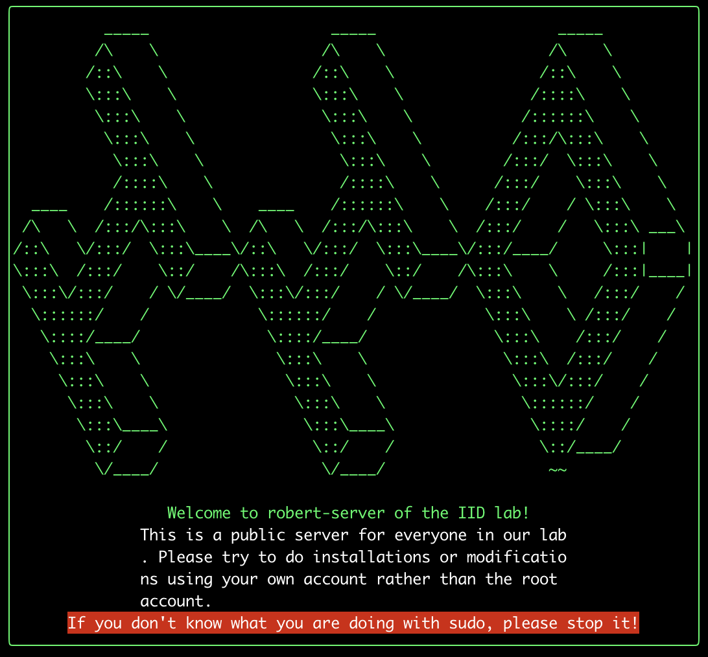

# A Message-Of-The-Day (motd) generator

Sometimes your want to show colorful text in the Message-Of-The-Day (motd), but you cannot edit the file in some plain text editor. This tool allows you to generate the Message-Of-The-Day (motd) file for Unix systems: `/etc/motd` easily!

## Usage

First, clonse this repository and install all the npm packages needed. Node.js and NPM are required.

```shell
$ git clone https://github.com/DerekDick/motd-generator.git
$ cd motd-generator
$ npm install
```

Next, generate the motd file and move it to `/etc/motd`.

```shell
$ script -q /dev/null -c "node ." > motd
$ cat motd # Check if the output is as expected
$ sudo mv ./motd /etc/motd # Replace the original motd file with the generated one
```

> `script` is a utility program in Linux kernel and you do not need to install any other packages.
> Currently the `script` on macOS is out dated, and doesn't support the `-c` option. I will try to get around it in future.

## Example

Here I use it to show a message for anyone who logs into the server of our lab.



You can modify the content in `index.js` and execute the commands specified in previous section to customize your own motd (Message Of The Day)!

## License

```
   Copyright 2020 DerekDick <frankderekdick@gmail.com>

   Licensed under the Apache License, Version 2.0 (the "License");
   you may not use this file except in compliance with the License.
   You may obtain a copy of the License at

       http://www.apache.org/licenses/LICENSE-2.0

   Unless required by applicable law or agreed to in writing, software
   distributed under the License is distributed on an "AS IS" BASIS,
   WITHOUT WARRANTIES OR CONDITIONS OF ANY KIND, either express or implied.
   See the License for the specific language governing permissions and
   limitations under the License.
```
